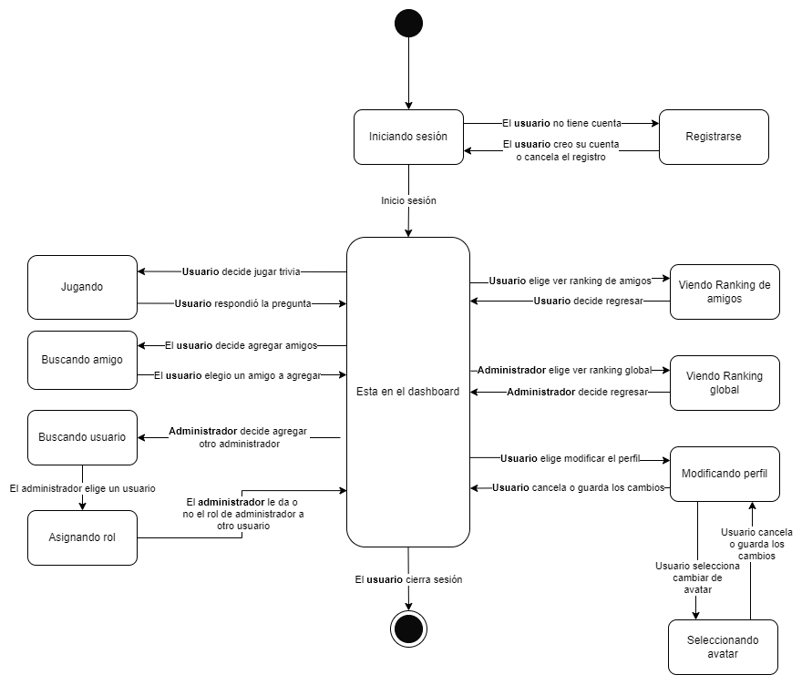

# Rutas del sitio

El siguiente diagrama de estado de una dia del flujo que seguirira un usuario
del sitio:



Todas las rutas de la API reciben y contestan con objetos JSON. Excepto a que se
mencione explicitamente, todas las rutas de la API reciben sus datos con un
`POST`.

Todas las rutas a excepcion de `/`, `/inicio-sesion` y `/registrarse` requieren
que el usuario este autenticado. De no estar autenticado se le redireccionara a
`/inicio-sesion`.

De no estar autenticado, las rutas de la API responderan con:

```JSON
{
    "error": {
        "status": 401,
        "detail": "Debe estar autenticado primero"
    }
}
```

# Formato de las respuestas

Las respuestas del servidor tienen que contener uno (pero no ambos) de los 
siguientes miembros a nivel superior:

* `data`
* `error`

Opcionalmente puede tener a nivel superior un miebro `alert`.

## `data`

Se retornaria si la operacion se realizo correctamente.

Este no tiene ningun formato en especifico, unicamente contiene la respuesta a
la solicitud que se haya hecho.

## `error`

Se retornaria si ocurrio un error interno, o un error inesperado al procesar los
datos del usuario.

Este sigue el siguiente formato:

```typescript
{
    /** Una descripcion detallada del error */
    detail: string,

    /** Un resumen del error */
    title?: string,

    /** EL codigo HTTP aplicable al problema */
    status?: number,

    /** Link que contiene mas informacion sobre el problema en especifico */
    about_link?: string,

    /** Informacion que pueda ser util para encontrar el problema */
    debug?: any
}
```

## `alert`

Este contiene informacion que se mostrara al usuario en un toast. Sigue el
siguiente formato:

```typescript
{
    /** Mensaje a mostrar */
    message: string,

    /** Resumen del mensaje */
    title?: string,

    /** Boton para tomar alguna accion luego de leer el mensaje */
    button?: {
        /** Link que seguira el boton */
        link: string,
        /** Texto que tendra el boton */
        text: string
    }
}
```

# Index

## `/`

No tiene nada, unicamente refiere al usuario a que inice sesion o que se
registre.

# Inicio de Sesion

## `/inicio-sesion`

Le solicita al usuario su correo y contraseña. De ser correctos, lo redirije a
`/dashboard`. De otro modo, se lo indica al usuario.

## `/api/inicio-sesion`

Recibe un objeto en la siguiente forma:

```typescript
{
    email: string,
    password: string
}
```

Valida las credenciales, y responde con `data` en la forma:

```typescript
{
    valid: boolean
}
```

Guarda en una sesion en el servidor del usuario.

# Registro

## `/registrarse`

Le solicita al usuario:

* Nombres
* Apellidos
* Fecha de nacimiento
* Correo electronico
* Contraseña
* Si acepta recibir correos

**Nota:** Refierase a el documento de requerimientos para ver las restricciones
en las entradas del usuario

De registrarse exitosamente se le redirige a `/inicio-sesion`.

## `/api/registrarse`

Recibe un objeto en la siguiente forma:

```typescript
{
    name: string,
    surname: string,
    birthDate: string,
    email: string, 
    password: string,
    wantsEmails: boolean
}
```

Donde `birthDate` se obtuvo de un objeto `Date` usando el metodo
`toUTCString` [^1].

[^1]: Para que sea mas sencillo obtener la fecha desde python.
[Referencia](https://stackoverflow.com/questions/8153631/js-date-object-to-python-datetime).

El servidor respondera con `data` en la forma:

```typescript
{
    /** Verdadero si el usuario fue registrado */
    registered: boolean,
    
    /** 
     * Explicacion en texto plano de porque no se pudo registrar al usuario
     * 
     * Ex. "El correo ya esta en uso por otra cuenta"
     */
    whyNot?: string,

    /**
     * Los campos que el usuario tiene que corregir para registrarse
     * 
     * Ex. ["email"]
     */
    offendingFields?: string[]
}
```
# Dashboard

## `/dashboard`

Le permite al usuario ir a:

* Su pagina de perfil (`/profile`).
* La seccion de trivia (`/trivia`).
* Agregar amigos (`/add-friend`).
* Ver el ranking de amigos (`/friend-rank`).

Tambien le mostrara al usuario:

* Su puntaje y nivel.
* Las solicitudes de amistad que tenga pendientes.

Adiciolamente permitira al administrador ir a:

* Ver el ranking global (`/global-rank`).
* Agregar otros administradores (`/add-admin`).

## `/api/dasboard-data`

**Metodo:** `GET`

Responde con `data` en la forma:

```typescript
{
    name: string,
    surname: string,
    score: number,
    level: number,
    avatar: string, // La url del avatar seleccionado
    friendRequests: FriendRequest[]
}
```

Donde `FriendRequest` se define como:

```typescript
{
    senderId: number,
    name: string,
    surname: string,
    avatar: string
}
```
## `/api/process-friend-request`

Recibe un objeto en la forma:

```typescript
{
    accepted: boolean,
    senderId: number
}
```

Y responde con `data` en la forma:

```typescript
{
    processed: boolean
}
```
# Trivia

<!-- TODO: Revisar los cambios en casa, y terminar -->